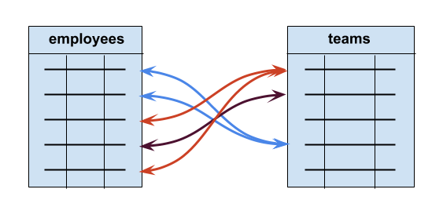

```{r setup, include=FALSE}
knitr::opts_chunk$set(echo = TRUE, fig.align = 'center')
```

# Learning Objectives<br>

* Recap the different types of table relationships
* Recap how keys create relationships

**Duration - 20 minutes**

# Introduction

So far we have been extracting, manipulating and returning data from **single tables** in the database. But we know from our discussion yesterday that **relationships** between tables are important in `SQL`. After all, we are learning about **relational databases** in general.

This will lead naturally to the concept of **joins** in `SQL`. Recall that you have seen these in `dplyr`, and the concepts here will very similar, save that `SQL` formalises table relationships to a degree beyond what you've experienced in `dplyr`. For example, imagine you are trying to add a record (row) to a table `A` linked by a **foreign key** relationship to another table `B`. Before it allows the record to be added, `SQL` will check that the foreign key value included in the new row in table `A` matches a primary key value in table `B`. If it can't find that primary key value, it will not insert the record in table `A` and will likely throw an error.

# Type of table relationships

Remember, two tables can be related to each other in one of three ways:

* One-to-one
* One-to-many
* Many-to-many

where 'one' and 'many' refer to records (i.e. rows) in each of the tables. So the phrase 'one-to-one' should be read in full as 'one row in table `A` is linked to one row in table `B`', and so on. 

* One-to-one: one row in table `A` is linked to one row in table `B`.
* One-to-many: one row in table `A` is linked to many rows in table `B`, or vice-versa.
* Many-to-many: many rows in table `A` are linked to many rows in table `B`

There is an extra level of complexity to consider here: the possibility of **'zero'** arises, rather than 'one' or 'many' in the labels above. So, for example, we might have a 'one-to-zero-or-one' relationship between two tables `A` and `B`. This might mean that **not every** row in table `B` needs to be linked to a row in table `A`, but **if** a link exists, then it's one-to-one.  

We'll recap these relationships with examples of their use (in fact, the same examples we saw in `dplyr` joins last week), but first let's look at **keys** in `SQL`!

## Keys and data definition language (`DDL`)

Here are the definitions again of the two types of key from yesterday:

| Key | Description |
|---|---|
| Primary | Often the `id` column of a table. A unique value for each row that cannot be blank (`NULL`). The primary key gives us a way to uniquely identify a particular row in a table. |
| Foreign | A column in a table containing the **primary key of another table**. This is what establishes the link between a row in one table, and another row in a second table. |

Recall the `zoo` example from yesterday, where we looked at the `animals` and `diets` table:

```{r, echo=FALSE, fig.cap="The animals table", out.width = '75%'}

```

```{r, echo=FALSE, fig.cap="The diets table", out.width = '30%'}

```

The three table relationships come down to **how we insert foreign keys into tables, and what constraints we put upon them!** This is expressed in `SQL` by statements in **'data definition language' (`DDL`)** (AKA 'data description language'): a language in which we can express the **forms** of tables and databases.

Let's look at the `DDL` for the `animals` table. You can see this for yourself in `DBeaver` if you connect again to `zoo_pool`, double-click on the `animals` table, and then select `Properties` followed by `DDL` at the bottom left:

```{r, echo=FALSE, fig.cap="DDL for the animals table", out.width = '100%'}

```

`DDL` is a rich topic, but you can see the basics here. We specify the **name** and **data type** of each column in the table, we can specify **constraints** like `NOT NULL` (i.e. the `id` cannot be empty for a row), and down below we can specify keys: make `id` a `PRIMARY KEY`, and make `diet_id` a `FOREIGN KEY` that references the `id` column of the `diets` table.

We could also write the `DDL` for `animals` more concisely as:

```{sql, eval=FALSE}
CREATE TABLE public.animals (
  id INT4 PRIMARY KEY NOT NULL,
  name VARCHAR(50),
  age INT4,
  species VARCHAR(50),
  diet_id INT4 REFERENCES diets(id)
);
```

<br>
<blockquote class='task'>
**Task - 2 mins** 

Have a look at the `DDL` for the `diets` table. Identify:

* Column names
* Data types
* Constraints
* Keys

<details>
<summary>**Solution**</summary>
```{r, echo=FALSE, fig.cap="DDL for the diets table", out.width = '100%'}

```

* Column names are `id` and `diet_type`
* Data types are `INTEGER` and `VARCHAR`
* Constraints: `id` cannot be `NULL`
* `id` is a `PRIMARY KEY`

</details>
</blockquote>
<br>

# One-to-one

Let's look again at the example of a tax database containing two tables: `citizens` and `tax_details`. We expect that **one** row in `citizens` will be linked to **one** row in `tax_details`, and vice-versa. So **each** citizen has **one** set of tax details, and **one** set of tax details will belong to **one** citizen.  

```{r, echo=FALSE, fig.cap="A one-to-one table relationship", out.width = '60%'}
knitr::include_graphics("images/One-to-One.png")
```

How do we arrange foreign keys to achieve this one-to-one relationship? We put a foreign key in **one** of the tables and make it **unique**. Here's the `DDL` specification:

```{sql, eval=FALSE}
CREATE TABLE public.citizens (
  id INT4 PRIMARY KEY,
  --and other columns...
)

CREATE TABLE public.tax_details (
  id INT4 PRIMARY KEY,
  citizen_id INT4 UNIQUE NOT NULL REFERENCES citizens(id),
  --and other columns...
)
```

In this case we make the `citizen_id` foreign key `NOT NULL` as well, as it doesn't make much sense for this use case to have a tax details record that is not linked to a citizen.

Here's a summary of the table design:

* each `tax_details` record **must** be linked to **one and only one** `citizens` record
* each `citizens` record is linked to **zero or one** `tax_details` record

Strictly speaking, this is a **one-to-zero-or-one** relationship. True one-to-one relationships are better implemented within a single table.

# One-to-many

Now here's the example of a database for a corporation containing one table holding the details of `employees` and another for the `teams` that employees may belong to. The relationship we wish to model is that **one** employee must belong to **one** team, but a team may have **many** employees.

```{r, echo=FALSE, fig.cap="A one-to-many table relationship", out.width = '60%'}

```

We could implement this in `DDL` like so:

```{sql, eval=FALSE}
CREATE TABLE public.teams (
  id INT4 PRIMARY KEY,
  --and other columns...
)

CREATE TABLE public.employees (
  id INT4 PRIMARY KEY,
  team_id INT4 NOT NULL REFERENCES teams(id),
  --and other columns...
)
```

Notice we've removed the `UNIQUE` constraint here: we want to allow multiple employees to belong to a single team. 

<br>
<blockquote class='task'>
**Task - 5 mins**  
  
Examine the table design above, and try to summarise it as in the form above:

* each `employees` record...
* each `teams` record... 

<details>
<summary>**Solution**</summary>

* each `employees` record **must** be linked to **one** `teams` record
* each `teams` record is linked to **zero, one or many** `employees` records

</details>
</blockquote>

# Many-to-many

Finally, we come again to a database for a project planning application with tables for `employees` and `projects`. The relationship we wish to model is that an employee can be involved in **many** projects, and a project can involve many **employees**.

Recall that for a many-to-many relationship, we need to insert a third table called a **join table** to hold the details of the relationship (the `involvements` table in this example). **Two foreign keys will be held in the join table**, which will also have its own primary key and may have other columns.

```{r, echo=FALSE, fig.cap="A many-to-many table relationship", out.width = '80%'}
knitr::include_graphics("images/Many-to-Many.png")
```

Let's see the `DDL`:

```{sql, eval=FALSE}
CREATE TABLE public.employees (
  id INT PRIMARY KEY,
  --and other columns...
)

CREATE TABLE public.projects (
  id INT PRIMARY KEY,
  --and other columns...
)

CREATE TABLE public.involvements (
  id INT PRIMARY KEY,
  employee_id INT NOT NULL REFERENCES employees(id),
  project_id INT NOT NULL REFERENCES projects(id).
  --and potentially other columns...
)
```

Let's summarise the design:

* each `employees` record can be linked to **zero, one or many** `involvements` records.
* each `involvements` record **must** be linked to **one** `employees` record.

and

* each `projects` record can be linked to **zero, one or many** `involvements` records.
* each `involvements` record **must** be linked to **one** `projects` record.

So you can see that we have replaced a single many-to-many relationship with **two** one-to-many relationships.


