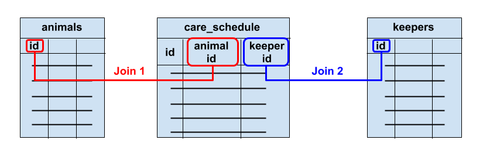

```{r setup, include=FALSE}
knitr::opts_chunk$set(echo = TRUE, fig.align = 'center')
```

# Learning Objectives

* Understand `INNER JOIN`, `LEFT JOIN` and `RIGHT JOIN`
* Understand how to join tables in a many-to-many relationship
* See how joins combine with the other parts of the query syntax.

**Duration - 90 minutes**

# Introduction

We've recapped the three types of relationship that can exist between tables. Now it's time to see how to perform joins in `SQL`. Again, our aim is to be able to extract data from multiple tables in a single query.

We'll use the `zoo_pool` database, so re-establish your connection to it in `DBeaver` if it has lapsed.

```{r, eval=TRUE, include=FALSE, message=FALSE, warning=FALSE}
library(knitr)
library(kableExtra)
library(RPostgres)

db = dbConnect(
  Postgres(), 
  user = 'zoo_user',
  password = 'd0vbgcf0oy09pg7e',
  dbname = 'zoo_pool',
  host = 'db-postgresql-lon1-94437-do-user-4831272-0.a.db.ondigitalocean.com',
  port = 25061,
  sslmode = 'require',
  bigint = "numeric"
)
```

<br>
<blockquote class='task'>
**Task - 5 mins**

Prepare for the rest of the lesson by having a look at the data in each of the tables in the `zoo_pool` database (either just look at the `Data` tab for each table, or write and run queries)

<details>
<summary>**Solution**</summary>

```{sql, connection = db, output.var="out"}
SELECT * FROM animals;
```
```{r, echo=FALSE, eval=TRUE}
out
```

```{sql, connection = db, output.var="out"}
SELECT * FROM diets;
```
```{r, echo=FALSE, eval=TRUE}
out
```

```{sql, connection = db, output.var="out"}
SELECT * FROM keepers;
```
```{r, echo=FALSE, eval=TRUE}
out
```

```{sql, connection = db, output.var="out"}
SELECT * FROM care_schedule;
```
```{r, echo=FALSE, eval=TRUE}
out
```
</details>
</blockquote>
<br>

# `INNER JOIN`

How can we solve the following problem:

<br>
<center>
**"Get a list of all the animals that have diet plans together with the diet plans that they are on."**
</center>
<br>

We use an `INNER JOIN`! Let's write the query and then describe what it does.

```{sql, connection = db, output.var="out"}
SELECT 
  animals.*, 
  diets.*
FROM animals INNER JOIN diets
ON animals.diet_id = diets.id;
```
```{r, echo=FALSE, eval=TRUE}
out
```

* `animals INNER JOIN diets` tells SQL to join the `animals` table to the `diets` table.
* `ON animals.diet_id = diets.id` tells SQL **how to do the join**. This says 'take the rows from `animals` and the rows from `diets` and match them by `diet_id` in `animals` equalling `id` in `diets`'.
* `INNER JOIN` means 'return only those rows where there is such a match'.

You can see in the results above that the `diet_id` values from `animals` all match the `id` values from `diets`.

It might help to think of 'cutting' both tables up into separate records, and then 'glueing' records together into a joined result, so that primary key matched foreign key and creating duplicate records if needed to balance the numbers required. 

```{r, echo=FALSE, fig.cap="Joining the `animals` and `diets` tables. Think of 'cutting' both tables into individual records and then 'glueing' them together so that primary key (PK) matches foreign key (FK). Here we need to create 'duplicate' `diets` records in the joined table.", out.width = '80%'}

```

We can control the columns returned:

```{sql, connection = db, output.var="out"}
SELECT 
  animals.name, 
  animals.species, 
  diets.diet_type
FROM animals INNER JOIN diets
ON animals.diet_id = diets.id;
```
```{r, echo=FALSE, eval=TRUE}
out
```

and we can also use **table aliases** to make queries more compact to write:

```{sql, connection = db, output.var="out"}
SELECT 
  a.name, 
  a.species, 
  d.diet_type
FROM animals AS a INNER JOIN diets AS d
ON a.diet_id = d.id;
```
```{r, echo=FALSE, eval=TRUE}
out
```

Previously we've seen `AS` being used in the `SELECT` clause to alias **columns**. Here we use it in the `FROM` clause to alias **tables**.

We can combine joins with all the other query syntax we've learned recently! Here are a few examples:

<br>
<center>
**"Find any known dietary requirements for animals over four years old."**
</center>
<br>

```{sql, connection = db, output.var="out"}
SELECT 
  a.id, 
  a.name, 
  a.species, 
  a.age, 
  d.diet_type
FROM animals AS a INNER JOIN diets AS d
ON a.diet_id = d.id
WHERE a.age > 4;
```
```{r, echo=FALSE, eval=TRUE}
out
```

<br>
<center>
**"Breakdown the number of animals in the zoo by their diet types."**
</center>
<br>

```{sql, connection = db, output.var="out"}
SELECT 
  d.diet_type, 
  COUNT(a.id)
FROM animals AS a INNER JOIN diets AS d
ON a.diet_id = d.id
GROUP BY d.diet_type;
```
```{r, echo=FALSE, eval=TRUE}
out
```

<br>
<blockquote class='task'>
**Task - 3 mins**

Write a query to return the requested data:

<br>
<center>
**"Get the details of all herbivores in the zoo."**
</center>
<br>

<details>
<summary>**Solution**</summary>
```{sql, connection = db, output.var="out"}
SELECT 
  a.id, 
  a.name, 
  a.age, 
  a.species, 
  d.diet_type
FROM animals AS a INNER JOIN diets AS d
ON a.diet_id = d.id
WHERE d.diet_type = 'herbivore';
```
```{r, echo=FALSE, eval=TRUE}
out
```
</details>
</blockquote>
<br>

# `LEFT JOIN` and `RIGHT JOIN`

So, `INNER JOIN` returns only those joined records where there is match in the condition we specify. Let's see this again

```{sql, connection = db, output.var="out"}
SELECT 
  a.*, 
  d.*
FROM animals AS a INNER JOIN diets AS d
ON a.diet_id = d.id;
```
```{r, echo=FALSE, eval=TRUE}
out
```

There's no sign of Gerry the Goldfish, or Kim the Kangaroo, as these animals have `NULL`s for `diet_id`. Ditto, tofu is missing from the table, as no animal has a `diet_id` of 4 (i.e. no animal prefers tofu).

But what if we want **all** of the records from **one** of the tables, regardless of whether there is a match in the condition. You may recall from `dplyr` joins that we can do this with a `LEFT JOIN` or a `RIGHT JOIN`. See the following problem.

<br>
<center>
**"Return the details of *all* animals in the zoo, together with their dietary requirements if they have any."**
</center>
<br>

```{sql, connection = db, output.var="out"}
SELECT 
  a.*, 
  d.*
FROM animals AS a LEFT JOIN diets AS d
ON a.diet_id = d.id;
```
```{r, echo=FALSE, eval=TRUE}
out
```

Now we see **all** the animals, including Gerry and Kim, although they have no dietary requirements.

So `LEFT JOIN` says **'keep all the records in the left table, adding in any matching records from the right table'**. 'Left' here indicates the table to the left of the `LEFT JOIN` operator, i.e. `animals`.

<br>
<blockquote class='task'>
**Task - 5 mins** 

Write and then execute a query to perform a similar `RIGHT JOIN`. How do you interpret the results you see? Discuss with the people around you.

<details>
<summary>**Hint**</summary>
Think about the **relationship** between the `animals` and `diets` tables. Is it one-to-one, one-to-many or many-to-many?
</details>

<details>
<summary>**Solution**</summary>

```{sql, connection = db, output.var="out"}
SELECT 
  a.*, 
  d.*
FROM animals AS a RIGHT JOIN diets AS d
ON a.diet_id = d.id;
```
```{r, echo=FALSE, eval=TRUE}
out
```

The relationship between the tables is **'one `diets` record may be linked to zero, one or many `animals` records'**. So, when we perform the `RIGHT JOIN`, we expect that each `diets` record will appear **at least once** in the joined table, and possibly many times, if multiple animals have that diet. This is why we see `tofu`, even though no animal has that `diet_type`.  

</details>
</blockquote>
<br>

`LEFT JOIN`s and `RIGHT JOIN`s are useful in problems like this:

<br>
<center>
**"Return how many animals follow each diet type, including any diets which no animals follow."**
</center>
<br>

Obviously we need to group records by `diet_type` here, but grouping just the `animals` records will not solve the problem, as we would miss 'tofu' (since no animals follow a tofu diet). We need to group the results of the `RIGHT JOIN` we just wrote:

```{sql, connection = db, output.var="out"}
SELECT 
  d.diet_type, 
  COUNT(a.id) AS num_animals
FROM animals AS a RIGHT JOIN diets AS d
ON a.diet_id = d.id
GROUP BY d.diet_type;
```
```{r, echo=FALSE, eval=TRUE}
out
```

We still return `COUNT(a.id)`, as we want to know how many **animals** there are in each `diet_type` group, even if, as in the case of 'tofu', no animals are in that group.

## Using `RIGHT JOIN` or `LEFT JOIN` by 'default'

Many `SQL` programmers prefer to stick to always using just one of `LEFT JOIN` or `RIGHT JOIN` by 'default' (and they often choose `LEFT JOIN`). So, they re-arrange their 'mental model' of the relationship between the tables to fit their choice of join. 

Let's re-run the query above as a `LEFT JOIN` to prove it's feasible this way too!

```{sql, connection = db, output.var="out"}
SELECT 
  d.diet_type, 
  COUNT(a.id) AS num_animals
FROM diets AS d LEFT JOIN animals AS a
ON d.id = a.diet_id
GROUP BY d.diet_type;
```
```{r, echo=FALSE, eval=TRUE}
out
```

# `FULL OUTER JOIN`

What happens if we want all results from both tables whether they have matches or not. `FULL OUTER JOIN` combines the results of both left and right joins and returns **all** (matched or unmatched) rows from the tables on **both** sides of the join.

Let's take a look at the results of a full outer join in our animals and diets example:

```{sql, connection = db, output.var="out"}
SELECT 
  a.*, 
  d.*
FROM animals AS a 
FULL OUTER JOIN diets AS d
ON a.diet_id = d.id
```
```{r, echo=FALSE, eval=TRUE}
out
```

We can see that matching entries are returned, as expected, but also:

* 'Gerry the Goldfish' and 'Kim the Kangaroo' appear, even though they have no matching row in `diets` 
* 'tofu' appears, even though there are no matching `animals` for this diet 

This representation of the different types of join might be useful (but if not, don't worry, it relies on you having seen Venn diagrams before):

```{r, echo=FALSE, fig.cap="Venn diagrams of different types of SQL joins", out.width='80%'}

```

# Joins in many-to-many relationships

Finally, let's see how to use joins to extract data from tables linked by a many-to-many relationship. Remember we have an extra **join table** in a many-to-many table.

In the `zoo` database, we have a many-to-many relationship between `animals` and `keepers`, i.e.<br><br>

<br>
<center>
**"Each animal is cared for by many keepers, and each keeper cares for many animals"**
</center>
<br>

The join table is called `care_schedule`. Each record in `care_schedule` tells us which keeper is looking after which animal, on which day.<br>

```{r, echo=FALSE, fig.cap="Many-to-many relationship between `animals` and `keepers` with join table `care_schedule`", out.width = '80%'}

```

Now we're asked to answer the following problem:

<br>
<center>
**"Get a rota for the keepers and the animals they look after, ordered first by animal name, and then by day."**
</center>
<br>

In order to join `animals` to `keepers` we have to go in two 'hops': first, a join from `animals` to `care_schedule`; and second, a join from `care_schedule` to `keepers`. 

Let's write the query and then describe it step by step. Don't be put off, this looks complicated, but think of building it up bit by bit...

```{sql, connection = db, output.var="out"}
SELECT 
  a.name AS animal_name,
  a.species,
  cs.day, 
  k.name AS keeper_name
FROM 
  (animals AS a INNER JOIN care_schedule AS cs
    ON a.id = cs.animal_id)
INNER JOIN keepers AS k
ON cs.keeper_id = k.id
ORDER BY a.name, cs.day;
```
```{r, echo=FALSE, eval=TRUE}
out
```

You see we have two `JOIN` operators. Here's one way to visualise this:<br>

```{r, echo=FALSE, fig.cap="The output of the `JOIN` from `animals` to `care_schedule` is then further `JOIN`ed to `keepers`.", out.width = '80%'}
knitr::include_graphics("images/Multi-step-joins.png")
```

Think of the output table from `animals` to `care_schedule` being **further joined** to `keepers`, i.e.

<br>
<center>
**`(animals INNER JOIN care_schedule ON...) INNER JOIN keepers ON`...**
</center>
<br>

The `INNER JOIN` in parentheses is executed first, and the output from it is then `INNER JOIN`ed to `keepers`.

<br>
<blockquote class='task'>
**Task - 5 mins**

How would we change the query above to show only the schedule for the keepers looking after Ernest the Snake?

<details>
<summary>**Hints**</summary>

* We need a `WHERE` clause.
* If we're limiting the results to those for Ernest, do we still need to order by animal name?
</details>

<details>
<summary>**Solution**</summary>

```{sql, connection = db, output.var="out"}
SELECT 
  cs.day, 
  k.name AS keeper_name
FROM 
  (animals AS a INNER JOIN care_schedule AS cs
    ON a.id = cs.animal_id)
INNER JOIN keepers AS k
ON cs.keeper_id = k.id
WHERE a.name = 'Ernest'
ORDER BY cs.day;
```
```{r, echo=FALSE, eval=TRUE}
out
```

</details>
</blockquote>
<br>

# Self joins

Sometimes, you might want to **join a table to itself!**. Why would this ever arise? Sometimes you may find a column in a table that looks like a foreign key, but with the odd fact that it references the primary key (or another identifying column) **of its own table**!

Let's see an example in the `keepers` table:

```{sql, connection = db, output.var="out"}
SELECT *
FROM keepers;
```
```{r, echo=FALSE, eval=TRUE}
out
```

You can see we have the `manager_id` column that looks as if it might be a foreign key. But when we check the `DDL` of `keepers`:

```{r, echo=FALSE, fig.cap="DDL for the keepers table.", out.width = '80%'}

```

we find that `manager_id` references the `id` column of the same table: `keepers`. This is telling us that some of the `keepers` act as managers for other `keepers`. Sometimes you may find tables with relationships similar to this in which `manager_id` is not declared to be a `FOREIGN KEY`, but the intention would likely be the same.

Now, think about how we would write a query to answer the following request:

<br>
<center>
**"Get a table showing the name of each keeper, together with their manager's name (if they have a manager)."**
</center>
<br>

We need to add an extra column to each row pulling in information from **other rows in the table**. For example, look at 'Tony': his manager is the keeper with `id = 5` ('Xiao'), so information from the row with `id = 5` will need to be added to the row with `id = 1`.  

A **self join** is the way to do this, we ask the `keepers` table to play **two roles** in the join: once as a source of 'keepers', and a second time as a source of 'managers'. In this case, we want all keepers (even if they don't have a manager), so we use a `LEFT JOIN`:

```{sql, connection = db, output.var="out"}
SELECT 
  k.name AS employee_name,
  m.name AS manager_name
FROM keepers AS k
LEFT JOIN keepers AS m
ON k.manager_id = m.id;
```
```{r, echo=FALSE, eval=TRUE}
out
```

# Additional topics - Optional

## `UNION` and `UNION ALL`

We won't go into them too much, but for awareness there is also a `UNION` operator. Basically, this allows you to **'stack'** tables on top of each other, providing:

* the tables have the same number of columns
* the columns are of similar data types. 

They are different to `JOIN`s because you are stacking the columns rather than joining via a key relationship. 

There is a function `UNION ALL`, which stacks tables exactly as they are, and `UNION`, which stacks but removes any duplicate entries which have appeared in both tables. 

Here's a bit of a 'fake' example where we try to stack the `animals` table twice using `UNION`:

```{sql, connection = db, output.var="out"}
SELECT *
FROM animals 
UNION 
SELECT *
FROM animals
```
```{r, echo=FALSE, eval=TRUE}
out
```

Hmm, we see each animal only **once** though, as `UNION` removes any duplicate rows! We can get our desired replication of the table using `UNION ALL`:

```{sql, connection = db, output.var="out"}
SELECT *
FROM animals 
UNION ALL
SELECT *
FROM animals
```
```{r, echo=FALSE, eval=TRUE}
out
```

## Tip - finding entries which don't match in a `JOIN`

Sometimes you may want to find those entries in a table which are **not** matched in another table! 

There is a helpful way of doing this - `LEFT JOIN` to the table in which you want to find a match, but return only the rows where the join returns `NULL` i.e. there was no match found. 

For example the query below would return all the entries in the animals table that did not have a matching entry in the diet table. 

```{sql, connection = db, output.var="out"}
SELECT
  a.*
FROM animals AS a 
LEFT JOIN diets AS d
ON a.diet_id = d.id
WHERE d.id IS NULL
```
```{r, echo=FALSE, eval=TRUE}
out
```

## Column number shortcuts for `GROUP BY` and `ORDER BY`

In some versions of `SQL` you can replace variable names with column numbers in `GROUP BY` and `ORDER BY`. 

It is better practice to fully write out column names, as it is easier to read and understand, but you may see syntax like this in other people's code. It's also undeniably useful for quick checks when you are dealing with many columns. 

So we can replace the `ORDER BY` statement in this query:

```{sql, connection = db, output.var="out"}
SELECT 
  a.name AS animal_name, 
  cs.day, 
  k.name AS keeper_name
FROM 
  (animals AS a INNER JOIN care_schedule AS cs
    ON a.id = cs.animal_id)
INNER JOIN keepers AS k
ON cs.keeper_id = k.id
ORDER BY a.name, cs.day
```
```{r, echo=FALSE, eval=TRUE}
out
```

with:

```{sql, connection = db, output.var="out"}
SELECT 
  a.name AS animal_name, 
  cs.day, 
  k.name AS keeper_name
FROM 
  (animals AS a INNER JOIN care_schedule AS cs
    ON a.id = cs.animal_id)
INNER JOIN keepers AS k
ON cs.keeper_id = k.id
ORDER BY 1, 2
```
```{r, echo=FALSE, eval=TRUE}
out
```

```{r, eval=TRUE, include=FALSE, message=FALSE, warning=FALSE}
dbDisconnect(db)
```
