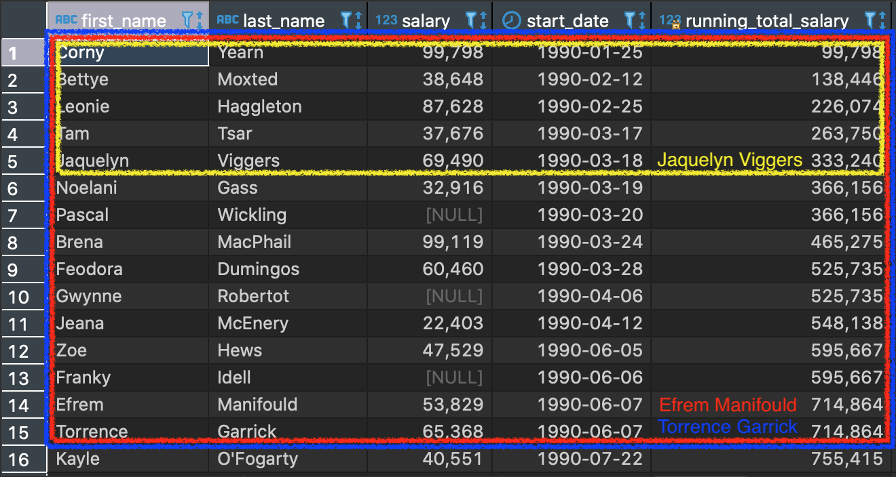

```{r setup, include=FALSE}
knitr::opts_chunk$set(echo = TRUE, fig.align = 'center')
```

# Learning Objectives

* Understand the use of common table expressions to simplify complex queries.
* Understand the basic concepts of window functions.
* Have seen some examples of window definitions using `ORDER BY`, `GROUP BY` and their combination.
* Be aware that more complex window definitions are possible.

**Duration - 120 minutes**

# Introduction

In this lesson we will look at two more recent additions to the `SQL` standard: **common table expressions (CTEs)** and **window functions**.

We will use the `omni_pool` database, so re-establish your connection to it in `DBeaver` if it has lapsed.

```{r, eval=TRUE, include=FALSE, message=FALSE, warning=FALSE}
library(RPostgres)

db = dbConnect(
  Postgres(), 
  user = 'omni_user',
  password = 'in2z00yfv3as3hgo',
  dbname = 'omni_pool',
  host = 'db-postgresql-lon1-94437-do-user-4831272-0.a.db.ondigitalocean.com',
  port = 25061,
  sslmode = 'require',
  bigint = 'numeric'
)
```

# Common table expressions (CTEs)

Common table expressions (CTEs) are a useful addition made available in `ANSI SQL` in the `SQL:1999` standard.

Think of them as a 'temporary table' that you define and is then available to be used in a subsequent query. They can help you avoid writing complex queries involving subqueries, particularly where you might end up using the subquery more than once. They can also perform better than queries with more complex structure.

Let's see a simple example where a CTE can make a query more readable. We are going to try to solve the following problem:

<br>
<center>
**"Add a column for each employee showing the ratio of their salary to the average salary of their team."**
</center>
<br>

Our first thought for this might be "we'll need a table of the average salary of each team". Team `name` is stored in the `teams` table, whereas employee `salary` is in the `employees` table, so it seems we will need a join.  Let's write the query:

```{sql, connection = db, output.var="out"}
SELECT
	t.id,
	t.name,
	AVG(e.salary) AS avg_salary
FROM employees AS e INNER JOIN teams AS t
ON e.team_id = t.id
GROUP BY t.id
```
```{r, echo=FALSE, eval=TRUE}
out
```

Now we will need to join the `employees` table to the one that we just made. Based on what we've covered up until now, it looks like we will need to use the query above as a subquery: 

```{sql, connection = db, output.var="out"}
SELECT 
	e.first_name,
	e.last_name,
	team_avgs.name AS team_name,
	e.salary,
	e.salary / team_avgs.avg_salary AS salary_over_team_avg
FROM employees AS e INNER JOIN 
(
	SELECT
		t.id,
		t.name,
		AVG(e.salary) AS avg_salary
	FROM employees AS e INNER JOIN teams AS t
	ON e.team_id = t.id
	GROUP BY t.id
) AS team_avgs
ON e.team_id = team_avgs.id
ORDER BY e.team_id
```
```{r, echo=FALSE, eval=TRUE}
out
```

This is quite difficult to read and understand. Let's try writing this instead using a CTE:

```{sql, connection = db, output.var="out"}
WITH team_avgs(id, name, avg_salary) AS (
	SELECT
		t.id,
		t.name,
		AVG(e.salary)
	FROM employees AS e INNER JOIN teams AS t
	ON e.team_id = t.id
	GROUP BY t.id
)
SELECT 
	e.first_name,
	e.last_name,
	team_avgs.name AS team_name,
	e.salary,
	e.salary / team_avgs.avg_salary AS salary_over_team_avg
FROM employees AS e INNER JOIN team_avgs
ON e.team_id = team_avgs.id
ORDER BY e.team_id
```
```{r, echo=FALSE, eval=TRUE}
out
```

So, we name the CTE `team_avgs` after the `WITH` keyword, and then define it as a query enclosed in `AS ( )`. You see that we can also specify the names of the columns returned by the CTE, although this is not required (default columns names will be provided).

Finally, let's `ROUND()` the number of decimal places reported for the ratio:

```{sql, connection = db, output.var="out"}
WITH team_avgs(id, name, avg_salary) AS (
	SELECT
		t.id,
		t.name,
		AVG(e.salary)
	FROM employees AS e INNER JOIN teams AS t
	ON e.team_id = t.id
	GROUP BY t.id
)
SELECT 
	e.first_name,
	e.last_name,
	team_avgs.name AS team_name,
	e.salary,
	ROUND(e.salary / team_avgs.avg_salary, 3) AS salary_over_team_avg
FROM employees AS e INNER JOIN team_avgs
ON e.team_id = team_avgs.id
ORDER BY e.team_id
```
```{r, echo=FALSE, eval=TRUE}
out
```

Now, how could we change this query to instead report a `salary_over_country_avg` for each employee?

<br>
<blockquote class='task'>
**Task - 5 mins** 

* Write a query for the average `salary` of employees in each country (we want just two columns in this query: `country` and `avg_salary`).
* Use that query as a CTE (call it `country_avgs`).
* Use the `country_avgs` CTE to calculate the `salary_over_country_avg` column in the main query.
* [**Extension**] If you have time, can you figure out the syntax to define **multiple CTEs**, so you can write a query providing both `salary_over_team_avg` and `salary_over_country_avg` columns?

<details>
<summary>**Solution**</summary>
Here is the query for the average `salary` in each country:

```{sql, connection = db, output.var="out"}
SELECT
	country,
	AVG(salary) AS avg_salary
FROM employees 
GROUP BY country
```
```{r, echo=FALSE, eval=TRUE}
out
```

Now let's use that as a CTE to calculate `salary_over_country_avg` for each employee

```{sql, connection = db, output.var="out"}
WITH country_avgs(country, avg_salary) AS (
  SELECT
	  country,
	  AVG(salary)
  FROM employees 
  GROUP BY country
)
SELECT 
	e.first_name,
	e.last_name,
	country_avgs.country AS country,
	e.salary,
	ROUND(e.salary / country_avgs.avg_salary, 3) 
	  AS salary_over_country_avg
FROM employees AS e INNER JOIN country_avgs
ON e.country = country_avgs.country
ORDER BY e.country
```
```{r, echo=FALSE, eval=TRUE}
out
```

**Extension**
```{sql, connection = db, output.var="out"}
WITH 
team_avgs(id, name, avg_salary) AS (
	SELECT
		t.id,
		t.name,
		AVG(e.salary)
	FROM employees AS e INNER JOIN teams AS t
	ON e.team_id = t.id
	GROUP BY t.id
),
country_avgs(country, avg_salary) AS (
  SELECT
	  country,
	  AVG(salary)
  FROM employees 
  GROUP BY country
)
SELECT 
	e.first_name,
	e.last_name,
	country_avgs.country AS country,
	team_avgs.name AS team_name,
	e.salary,
	ROUND(e.salary / country_avgs.avg_salary, 3) 
	  AS salary_over_country_avg,
	ROUND(e.salary / team_avgs.avg_salary, 3) 
	  AS salary_over_team_avg
FROM employees AS e INNER JOIN country_avgs
ON e.country = country_avgs.country
INNER JOIN team_avgs
ON e.team_id = team_avgs.id
ORDER BY e.country, e.team_id
```
```{r, echo=FALSE, eval=TRUE}
out
```
</details>
</blockquote>
<br>

\pagebreak

# Window functions

So far you've seen **aggregate** functions applied mainly to columns of **grouped rows**: 

```{sql, connection = db, output.var="out"}
SELECT 
	department,
	AVG(salary) AS avg_salary
FROM employees
GROUP BY department;
```
```{r, echo=FALSE, eval=TRUE}
out
```

and perhaps to **whole tables**:

```{sql, connection = db, output.var="out"}
SELECT 
  AVG(salary) AS avg_salary
FROM employees
```
```{r, echo=FALSE, eval=TRUE}
out
```

When we apply aggregates to groups, you've seen that we lose access to the contents of individual rows. It's as if all we can extract from each row group are:

* values shared by all rows in the group (typically the value of the `GROUP BY` column for those rows)
* the results of aggregate functions run on each group of rows (`AVG()`, `SUM()`, `COUNT()` etc.)

But what if we want to apply aggregate functions (or other functions, as we'll see) to row groups *while retaining access to individual rows?* This is where **window functions** come to the rescue. These were added to `ANSI SQL` with the publication of the `SQL:2003` standard.

## What is a window function?

A window function is defined by the addition of the `OVER` keyword after a function in the `SELECT` part of a query.

```{sql, eval=FALSE}
SELECT
  function_name OVER (window_definition)
FROM ...
```

A `window_definition` in parentheses must immediately follow `OVER`: this defines **a window of rows relative to the current row** over which the function is applied. If we leave the parentheses empty, then we get the default window which corresponds to **the whole table**. Let's see an example:

```{sql, connection = db, output.var="out"}
SELECT 
  first_name,
  last_name,
  salary,
  SUM(salary) OVER () AS sum_salary
FROM employees;
```
```{r, echo=FALSE, eval=TRUE}
out
```

<br>
<center>
**This idea of the \emph{current row} is important for understanding window functions. Imagine the database system 'building up' the table returned by a query \emph{row-by-row}. The current row is the row being worked on by the system at that point in time.**
</center>
<br>

<br>
<blockquote class='task'>
**Task - 2 mins** 

Examine the results of the query above. 

* What do you think it is doing? 
* Could we obtain the same output with the `SQL` you have learned up until this point? [**Hint**: this is more tricky - think of using a *subquery*].  

<details>
<summary>**Solution**</summary>

The query adds a column `sum_salary` containing the sum of `salary` over the whole table. This happens because the default window of rows for a window function (defined by the `OVER ()` part) is the whole table.   
We could do the same thing with a subquery as follows:

```{sql, connection = db, output.var="out"}
SELECT 
  first_name,
  last_name,
  salary,
	(SELECT SUM(salary) FROM employees) AS sum_salary
FROM employees;
```
```{r, echo=FALSE, eval=TRUE}
out
```

This is generally true: window functions let you straightforwardly obtain that might otherwise require a complex subquery!
</details>
</blockquote>
<br>

So far, so what!? Well, we haven't yet really used the capabilities of the `OVER ()` window definition. We'll examine two keywords we can use between the parentheses: `ORDER BY` and `PARTITION BY`.

## `ORDER BY`

Let's see an example of using `ORDER BY` in the window definition.

<br>
<center>
**"Get a table of employees' names, salary and start date ordered by start date, together with a running total of salaries by start date."**
</center>
<br>

```{sql, connection = db, output.var="out"}
SELECT
  id,
	first_name,
	last_name,
	salary,
  start_date,
  SUM(salary) OVER (ORDER BY start_date ASC NULLS LAST) AS running_total_salary
FROM employees;
```
```{r, echo=FALSE, eval=TRUE}
out
```

`ORDER BY` makes the window for the **current row** run from the start of the table up to that row (including any rows with the **same value** of ordering variable as the current row).

<br>
<blockquote class='task'>
**Task - 2 mins**

Look at the table produced by the query above.

* What is the window for the 'Jaquelyn Viggers' row? 
* Have a look at the 'Efrem Manifould' and 'Torrence Garrick' rows. Why do these rows have the **same value** of `running_total_salary`? What are the windows for these two rows? [**Hint** - think about the phrase above: 'including any rows with the same value of ordering variable as the current row']  

<details>
<summary>**Solution**</summary>

```{r, echo=FALSE, fig.cap="Windows for the 'Jaquelyn Viggers', 'Efrem Manifould' and 'Torrence Garrick' rows", out.width = '80%'}

```
\FloatBarrier

The 'Efrem Manifould' and 'Torrence Garrick' rows have the same `running_total_salary` as these employees had the same `start_date` (the ordering variable). So, both rows have the same window, and hence the same `running_total_salary`.  
</details>
</blockquote>
<br>

### `RANK()`, `DENSE_RANK()` and `ROW_NUMBER()`

Ranking is one of the main reasons `SQL` developers discover and then learn to use window functions. There are three 'ranking' window functions it is useful to know about: `RANK()`, `DENSE_RANK()` and `ROW_NUMBER()`. Which you use depends upon precisely what you are trying to achieve, as they each do subtly different things. Let's say we're trying to answer the following question:

<br>
<center>
**"Rank employees in order by their start date with the corporation."**
</center>
<br>

Which 'rank' you use depends upon what the intended application of the ranking values. Let's see what `RANK()` does: 

```{sql, connection = db, output.var="out"}
SELECT
  id,
	first_name,
	last_name,
	start_date,
  RANK() OVER (ORDER BY start_date ASC NULLS LAST) AS start_rank
FROM employees;
```
```{r, echo=FALSE, eval=TRUE}
out
```

<br>
<blockquote class='task'>
**Task - 5 mins** 

Add two extra columns to the query above, defined very similarly, but using the `DENSE_RANK()` and `ROW_NUMBER()` functions. Compare all three 'ranking' columns. How do they differ?

<details>
<summary>**Solution**</summary>  

```{sql, connection = db, output.var="out"}
SELECT
  id,
	first_name,
	last_name,
	start_date,
  RANK() OVER (ORDER BY start_date ASC NULLS LAST) AS start_rank,
  DENSE_RANK() OVER (ORDER BY start_date ASC NULLS LAST) AS start_dense_rank,
  ROW_NUMBER() OVER (ORDER BY start_date ASC NULLS LAST) AS start_row_num
FROM employees;
```
```{r, echo=FALSE, eval=TRUE}
out
```

* `RANK()` labels each value with it's ranked position in the column, but the labels can have gaps. So, for example, 'Efrem Manifould' and 'Torrence Garrick' both joined OmniCorp on the 7th June 1990 and are joint `RANK()` $14$, and 'Kayle O'Fogarty' is next at `RANK()` $16$, being the $16$th employee to join. So $15$ is missing.
* `DENSE_RANK()` doesn't allow for gaps in the rank labels, so 'Efrem Manifould' and 'Torrence Garrick' are both `DENSE_RANK()` $14$, as before, but now 'Kayle O'Fogarty' is `DENSE_RANK()` $15$.
* `ROW_NUMBER()` just ranks rows by the order they occur in the table. So, while 'Efrem Manifould' gets `ROW_NUMBER()` $14$ and 'Torrence Garrick', $15$, it might just as easily have been the other way around. For true ranking purposes, it makes sense to choose one of `RANK()` or `DENSE_RANK()`, as these have no ambiguities in what they output.
</details>
</blockquote>
<br>

### `NTILE()` - Optional
  
Let's see an example of another function to solve the following problem:

<br>
<center>
**"Split the salaries of employees into four groups corresponding to the 'quartiles' of salary (so, for example, group $1$ will contain the lowest $25\%$), group $2$ the next lowest $25\%$, and so on)."**
</center>
<br>

The `NTILE()` window function is designed for this task! Those of you from a more 'statistical' background might recognise this as the 'nth-quantile' function. We pass the number of groups into the function, so for our case we want `NTILE(4)`. We tell the window function which column to order rows on, the direction of ordering etc. We'll also order the rows by `id` to make the effect of `NTILE()` more clear:

```{sql, connection = db, output.var="out"}
SELECT
  id,
	first_name,
	last_name,
	salary,
	-- let's put NULLs in the first group
  NTILE(4) OVER (ORDER BY salary ASC NULLS FIRST) AS salary_group
FROM employees
ORDER BY id;
```
```{r, echo=FALSE, eval=TRUE}
out
```

You can see that `ORDER BY id` has overriden the `ORDER BY salary` passed in as the window definition. This works because, if you remember back to the recap yesterday, `SELECT` comes before `ORDER BY` in the order of execution of `SQL` queries:

| Order of execution | Keyword |
| --- | --- |
| ... | ... |
| 5 | `SELECT` (& window functions) |
| 6 | `ORDER BY` |
| ... | ... |

<br>
<blockquote class='task'>
**Task - 2 mins**

If the `NTILE()` function works as expected, we should expect each `salary_group` to contain $250$ rows. Let's check this!

Have a look at the following query, which uses a CTE to group the salaries first. Can you see how to complete it to count the number of rows in each `salary_group`?

```{sql, eval=FALSE}
WITH grouped_salaries(salary_group) AS (
  SELECT
    NTILE(4) OVER (ORDER BY salary ASC NULLS FIRST)
  FROM employees 
)
SELECT
  ...,
  COUNT(*) AS num_in_group
FROM ...
...
```

<details>
<summary>**Solution**</summary>  

```{sql, connection = db, output.var="out"}
WITH grouped_salaries(salary_group) AS (
  SELECT
    NTILE(4) OVER (ORDER BY salary ASC NULLS FIRST)
  FROM employees 
)
SELECT
  salary_group,
  COUNT(*) AS num_in_group
FROM grouped_salaries
GROUP BY salary_group
```
```{r, echo=FALSE, eval=TRUE}
out
```

## `PARTITION BY`

The `PARTITION BY` keyword defines the window for the current row as **the current row plus any other rows having the same value(s) in the column(s) specified after `PARTITION BY`**. The easiest way to understand this is probably with a few examples:

<br>
<center>
**"Show for each employee the number of other employees who are members of the same department as them."**
</center>
<br>

```{sql, connection = db, output.var="out"}
SELECT
  id,
  first_name,
  last_name,
  department,
  COUNT(*) OVER (PARTITION BY department) - 1 AS num_other_employees_in_department
FROM employees
ORDER BY id;
```
```{r, echo=FALSE, eval=TRUE}
out
```

<br>
<center>
**"Show for each employee the number of employees who started in the same month as them."**
</center>
<br>

This is a little bit trickier. Extracting just the month from the employees' start dates isn't specific enough, we also need to extract year too, and `PARTITION BY` the distinct pairings of month and year:

```{sql, connection = db, output.var="out"}
SELECT
  id,
  first_name,
  last_name,
  start_date,
  TO_CHAR(start_date, 'Month') || ' ' || TO_CHAR(start_date, 'yyyy') AS month,
  COUNT(*) OVER (
    PARTITION BY EXTRACT(MONTH FROM start_date), EXTRACT(YEAR FROM start_date)
  ) AS num_that_month
FROM employees
ORDER BY id;
```
```{r, echo=FALSE, eval=TRUE}
out
```

<br>
<blockquote class='task'>
**Task - 5 mins** 

Use a window function to answer the following problem:  

<br>
<center>
**"Get a table of employee id, first and last name, grade and salary, together with two new columns showing the maximum salary for employees of their grade, and the minimum salary for employees of their grade."**
</center>
<br>

<details>
<summary>**Solution**</summary>  

```{sql, connection = db, output.var="out"}
SELECT
  id,
  first_name,
  last_name,
  grade,
  salary,
  MAX(salary) OVER (PARTITION BY grade) AS max_salary_that_grade,
  MIN(salary) OVER (PARTITION BY grade) AS min_salary_that_grade
FROM employees
ORDER BY id;
```
```{r, echo=FALSE, eval=TRUE}
out
```
</details>
</blockquote>
<br>

Let's go back and see a more elegant solution to a problem we faced earlier (which we solved using a CTE):

<br>
<center>
**"Add a column for each employee showing the ratio of their salary to the average salary of their team."**
</center>
<br>

We now see that this can be solved with a window function using definition `OVER (PARTITION BY team_id)`:

```{sql, connection = db, output.var="out"}
SELECT 
	e.first_name,
	e.last_name,
	t.name AS team_name,
	e.salary,
	ROUND(e.salary / AVG(e.salary) OVER (PARTITION BY e.team_id), 3) 
	  AS salary_ratio_team_average
FROM employees AS e INNER JOIN teams AS t
ON e.team_id = t.id 
ORDER BY e.team_id
```
```{r, echo=FALSE, eval=TRUE}
out
```

So here `PARTITION BY e. team_id` says 'make the window for the current row all rows with the **same** `team_id`'. We then calculate the `AVG()` salary over that window, and use this as divisor for the `salary` of the current row to get the required ratio.

<br>
<blockquote class='task'>
**Task - 2 mins** 

As earlier, define another window function to add a column for each employee showing their salary as a ratio with their country's average.

<details>
<summary>**Solution**</summary>

```{sql, connection = db, output.var="out"}
SELECT 
	e.first_name,
	e.last_name,
	t.name AS team_name,
	e.salary,
	ROUND(e.salary / AVG(e.salary) OVER (PARTITION BY e.team_id), 3) 
	  AS salary_ratio_team_average,
	ROUND(e.salary / AVG(e.salary) OVER (PARTITION BY e.country), 3) 
	  AS salary_ratio_country_average
FROM employees AS e INNER JOIN teams AS t
ON e.team_id = t.id 
ORDER BY e.team_id
```
```{r, echo=FALSE, eval=TRUE}
out
```
</details>
</blockquote>
<br>

## `ORDER BY` and `PARTITION BY` together

Let's see an example of using an `ORDER BY` and `PARTITION BY` window definition in a query together!

<br>
<center>
**"Get a table of employees showing the order in which they started work with the corporation split by department"**
</center>
<br>

```{sql, connection = db, output.var="out"}
SELECT 
	first_name,
	last_name,
	start_date,
	department,
	RANK() OVER (PARTITION BY department ORDER BY start_date ASC NULLS LAST)
	  AS order_started_in_department
FROM employees 
ORDER BY start_date
```
```{r, echo=FALSE, eval=TRUE}
out
```

## Extra options in window definition - Optional

There are more options in defining windows than we have had time to cover here! As just one example, let's see how we might code a **moving average** using a window function. This is a statistics concept: a moving average is just an average over a pre-defined number of rows that 'moves' through the data. So, for example, a ten-row moving average of a given column would be, for the **current row**, an average over the column value on the current row, and the same column values on the previous nine rows.

To code this in `SQL`, we can specify a window by number of preceding rows! Let's do this for the `salary` column:

```{sql, connection = db, output.var="out"}
SELECT 
	start_date,
	salary,
	AVG(salary) OVER (ORDER BY start_date ASC ROWS 9 PRECEDING)
	  AS moving_avg_salary
FROM employees 
```
```{r, echo=FALSE, eval=TRUE}
out
```

This gives us our ten-row moving average (including the current row). Keywords `ROWS <num> PRECEDING` is one of the more advanced window definition options. In reality, you probably would not wish to calculate a moving average in this way as `start_date` is not spaced at uniform intervals (we could fix this by interpolation), but it is fine as a demonstration.

Another minor problem is that we shouldn't start to compute a moving average until we have at least nine preceding rows. We can fix this easily - let's use a CTE to keep the syntax clear:

```{sql, connection = db, output.var="out"}
WITH unfiltered(row_number, start_date, salary, moving_avg_salary) AS (
  SELECT
    ROW_NUMBER() OVER(ORDER BY start_date),
	  start_date,
	  salary,
	  AVG(salary) OVER (ORDER BY start_date ASC ROWS 9 PRECEDING)
	FROM employees
)
SELECT
  start_date,
  salary,
  CASE
    WHEN row_number >= 10 THEN moving_avg_salary
    ELSE NULL
  END AS moving_avg_salary 
FROM unfiltered
```
```{r, echo=FALSE, eval=TRUE}
out
```

See [this post](https://mjk.space/advanced-sql-window-functions/) and [this post](https://mjk.space/advances-sql-window-frames/), both by Michal Konarski, for further window definition options.

\pagebreak

# Suggestions for further study

* Setting up databases in `PostgreSQL`.
* Using views and materialised views to write more efficient `SQL` queries.
* Adding indices to columns to speed up slow queries.
* Stored procedures and triggers.